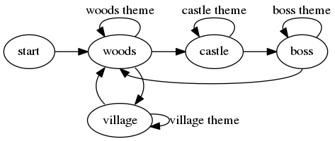

===========
digraph123_
===========

Play digraph_ shaped audio recordings using random walk.

Introduction
------------
A traditional audio recording has a single timeline from start to end. In the
language of directed graphs (digraphs) this can be described using two nodes
labeled "start" and "end" and an arrow (or *track*) going from "start" to "end".


Another type
of audio recording combines an intro part and a loop part. This can be described
using two nodes labeled "start" and "loop" and two tracks - one going from
"start" to "loop" and another going from "loop" back onto itself.


A *digraph shaped audio recording* is a generalization of the above concept to
the set of non-empty digraphs with one node labelled "start". Here's an example
inspired by simple adventure games:



**digraph123** defines a format for digraph shaped audio recordings and plays
such recordings from the "start" node using random walk.


Install from source
-------------------

Install Rust
````````````
An easy way to install the stable binaries for Linux and Mac is to run this in your shell::

    $ curl -sSf https://static.rust-lang.org/rustup.sh | sh

Get the source
``````````````
Clone or download from the `Github repo`_.

To clone::

    $ git clone https://github.com/mattias-p/digraph123.git
    $ cd digraph123

To download::

    $ wget https://github.com/mattias-p/digraph123/archive/master.zip
    $ unzip master.zip
    $ cd digraph123-master

Build and install
`````````````````
::

    $ cargo install 

Run
```
Play the included recording included in the example directory::

    $ digraph123 example

Learn more
``````````
Use the ``--help`` option for details on usage and operation::

    $ digraph123 --help


Contributing
------------
* Post bug reports and/or feature requests to the `issue tracker`_.
* Compose, record and publish and spread the word about digraph shaped audio.
* Look through the `issue tracker`_.
  for things to do and make pull requests to the `master branch`_.
* Have fun with it.


License
-------
    digraph123 plays digraph shaped audio recordings.
    Copyright (C) 2016  Mattias Päivärinta

    This program is free software: you can redistribute it and/or modify
    it under the terms of the GNU General Public License as published by
    the Free Software Foundation, either version 3 of the License, or
    (at your option) any later version.

    This program is distributed in the hope that it will be useful,
    WITHOUT ANY WARRANTY; without even the implied warranty of
    MERCHANTABILITY or FITNESS FOR A PARTICULAR PURPOSE.  See the
    GNU General Public License for more details.

    You should have received a copy of the GNU General Public License
    along with this program.  If not, see <http://www.gnu.org/licenses/>.


TODO
----

1. Getting started

   * Include example recording under some `Creative Commons`_ license

2. Installation

   * Point out some directions for installing Rust on Windows
   * Provide precompiled binaries

3. Documentation

   * Write documentation for the SPLICEPOINT Vorbis comment
   * Document library and script

4. Code

   * Create a test suite

.. _console:          https://en.wikipedia.org/wiki/Command-line_interface
.. _digraph123:       https://github.com/mattias-p/digraph123
.. _digraph:          https://en.wikipedia.org/wiki/Directed_graph
.. _issue tracker:    https://github.com/mattias-p/digraph123/issues
.. _master branch:    https://github.com/mattias-p/digraph123/tree/master
.. _Github repo:      https://github.com/mattias-p/digraph123
.. _Creative Commons: https://creativecommons.org/
